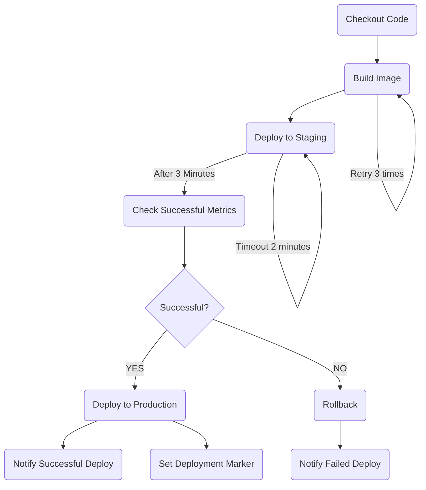

# Temporal Introduction

## Workflow



## Step0

What would it look like with a very naive simple Python.

```bash
make run-step-0
```

## Step1

What would it normally look like in the real world? queues or DB persistency with workers, state management, retries, etc.

## Step2

A rewrite of step0 with Python's async io, still naive

```bash
make run-step-2
```

## Step3

A Temporal Example

### Run Temporal

```bash
make start-temporal
```

### Run Temporal Workers

```bash
make start-workers
```

### Execute Workflow

```bash
make run-step-3
```
