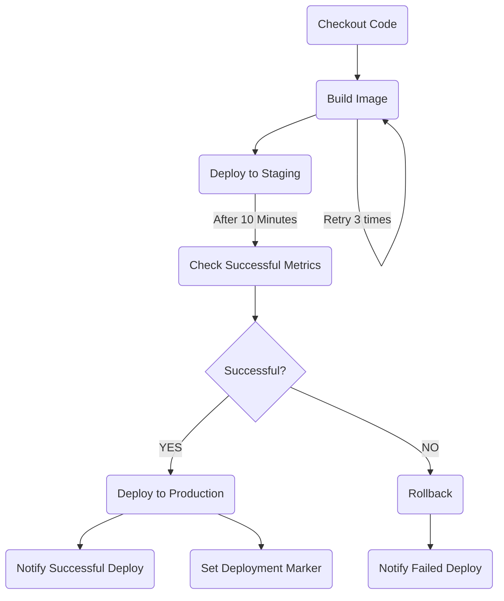

# Temporal Introduction

## Workflow

```mermaid
graph TD
A(Checkout Code)
B(Build Image)
C(Deploy to Staging)
D(Check Successful Metrics)
E{Successful?}
F(Deploy to Production)
G(Rollback)
H(Notify Successful Deploy)
I(Set Deployment Marker)
J(Notify Failed Deploy)

A --> B --> C -->|After 10 Minutes| D --> E -->|YES| F
B -->|Retry 3 times| B
E -->|NO| G
G --> J
F --> H
F --> I

```
